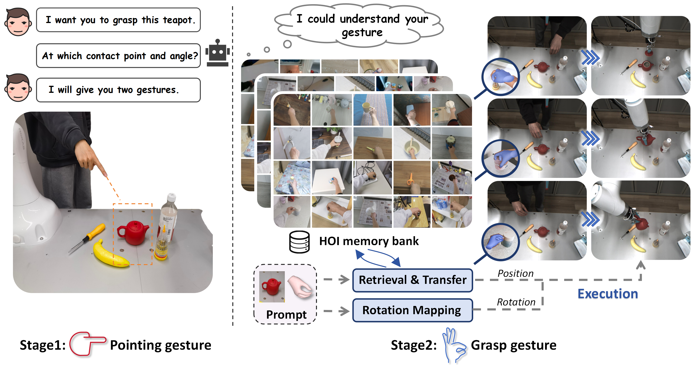

<div style="text-align: center; margin-top: -40px;">
  
</div>
 Overview of GAT-Grasp (Gesture-Driven Affordance Transfer for Task-Aware Robotic Grasping). A pointing gesture
(left) specifies the target region, while a grasp gesture (right) encodes the intended grasping strategy. Through retrieval-based
affordance transfer and rotation mapping, GAT-Grasp accurately interprets human intent and executes precise, task-specific
grasps on the robot.
<br>
<br>

<!-- Using HTML to center the abstract -->
<div class="columns is-centered has-text-centered">
    <div class="column is-four-fifths">
        <h2>Abstract</h2>
        <div class="content has-text-justified">
        
Achieving precise and generalizable grasping across diverse objects and environments is essential for intelligent and collaborative robotic systems. However, existing approaches often struggle with ambiguous affordance reasoning and limited adaptability to unseen objects, leading to suboptimal grasp execution. In this work, we propose GAT-Grasp, a gesture-driven grasping framework that directly utilizes human hand gestures to guide the generation of task-specific grasp poses with appropriate positioning and orientation. Specifically, we introduce a retrieval-based affordance transfer paradigm, leveraging the implicit correlation between hand gestures and object affordances to extract grasping knowledge from large-scale human-object interaction videos. By eliminating the reliance on pre-given object priors, GAT-Grasp enables zero-shot generalization to novel objects and cluttered environments. Real-world evaluations confirm its robustness across diverse and unseen scenarios, demonstrating reliable grasp execution in complex task settings.
        </div>
    </div>
</div>
<br>

<!-- Video Section -->
<div id="method_video" class="columns is-centered has-text-centered">
    <div class="column is-four-fifths">
        <h2>Video</h2>
        <div class="content has-text-justified">
          <video width="100%" controls muted loop>
            <source src="static/image/video.mp4" type="video/mp4">
            Your browser does not support the video tag.
          </video>
        </div>
    </div>
</div>

<br>

---

<!-- Additional Video Section -->
<div class="columns is-centered has-text-centered">
    <div class="column is-four-fifths">
        <h2>Real World Deployment</h2>
        <div class="content has-text-justified">
          <video width="100%" autoplay controls muted >
            <source src="static/image/teapot_video.mp4" type="video/mp4">
            Your browser does not support the video tag.
          </video>
        </div>
    </div>
</div>
Visualization of different grasping tasks performed on real robots. Based on the <span style="color: pink;">pink</span> pointing gesture and the <span style="color: blue;">blue</span> grasp gesture, the robot executes the corresponding actions in a zero-shot manner.

Explore additional experiments showcasing the performance of GAT-Grasp in diverse scenarios:
<!-- Video Grid Section -->
<div class="columns is-multiline is-centered has-text-centered">
    <!-- Video 1 -->
    <div class="column is-half">
        <video width="80%" autoplay controls muted loop>
            <source src="static/image/exp (1).mp4" type="video/mp4">
            Your browser does not support the video tag.
        </video>
    </div>

    <!-- Video 2 -->
    <div class="column is-half">
        <video width="80%" autoplay controls muted loop>
            <source src="static/image/exp (2).mp4" type="video/mp4">
            Your browser does not support the video tag.
        </video>
    </div>

    <!-- Video 3 -->
    <div class="column is-half">
        <video width="80%" autoplay controls muted loop>
            <source src="static/image/exp (3).mp4" type="video/mp4">
            Your browser does not support the video tag.
        </video>
    </div>

    <!-- Video 4 -->
    <div class="column is-half">
        <video width="80%" autoplay controls muted loop>
            <source src="static/image/exp (4).mp4" type="video/mp4">
            Your browser does not support the video tag.
        </video>
    </div>

    <!-- Video 5 -->
    <div class="column is-half">
        <video width="80%" autoplay controls muted loop>
            <source src="static/image/exp (5).mp4" type="video/mp4">
            Your browser does not support the video tag.
        </video>
    </div>

    <!-- Video 6 -->
    <div class="column is-half">
        <video width="80%" autoplay controls muted loop>
            <source src="static/image/exp (6).mp4" type="video/mp4">
            Your browser does not support the video tag.
        </video>
    </div>

    <!-- Video 7 -->
    <div class="column is-half">
        <video width="80%" autoplay controls muted loop>
            <source src="static/image/exp (7).mp4" type="video/mp4">
            Your browser does not support the video tag.
        </video>
    </div>

    <!-- Video 8 -->
    <div class="column is-half">
        <video width="80%" autoplay controls muted loop>
            <source src="static/image/exp (8).mp4" type="video/mp4">
            Your browser does not support the video tag.
        </video>
    </div>
</div>

<!-- ## 111
The paper "On Computable Numbers, with an Application to the Entscheidungsproblem" was published by Alan Turing in 1936. In this groundbreaking paper, Turing introduced the concept of a universal computing machine, now known as the Turing machine.

## Objective
Turing's main objective in this paper was to investigate the notion of computability and its relation to the Entscheidungsproblem (the decision problem), which is concerned with determining whether a given mathematical statement is provable or not.


## Key Ideas
1. Turing first presented the concept of a "computable number," which refers to a number that can be computed by an algorithm or a definite step-by-step process.
2. He introduced the notion of a Turing machine, an abstract computational device consisting of an infinite tape divided into cells and a read-write head. The machine can read and write symbols on the tape, move the head left or right, and transition between states based on a set of rules.
3. Turing demonstrated that the set of computable numbers is enumerable, meaning it can be listed in a systematic way, even though it is not necessarily countable.
4. He proved the existence of non-computable numbers, which cannot be computed by any Turing machine.
5. Turing showed that the Entscheidungsproblem is undecidable, meaning there is no algorithm that can determine, for any given mathematical statement, whether it is provable or not.


*Figure 1: A representation of a Turing Machine. Source: [Wiki](https://en.wikipedia.org/wiki/Turing_machine).*

## Table: Comparison of Computable and Non-Computable Numbers

| Computable Numbers | Non-Computable Numbers |
|-------------------|-----------------------|
| Rational numbers, e.g., 1/2, 3/4 | Transcendental numbers, e.g., π, e |
| Algebraic numbers, e.g., √2, ∛3 | Non-algebraic numbers, e.g., √2 + √3 |
| Numbers with finite decimal representations | Numbers with infinite, non-repeating decimal representations |

He used the concept of a universal Turing machine to prove that the set of computable functions is recursively enumerable, meaning it can be listed by an algorithm.

## Significance
Turing's paper laid the foundation for the theory of computation and had a profound impact on the development of computer science. The Turing machine became a fundamental concept in theoretical computer science, serving as a theoretical model for studying the limits and capabilities of computation. Turing's work also influenced the development of programming languages, algorithms, and the design of modern computers. -->

## BibTeX

```
@article{wang2025gat,
  title={GAT-Grasp: Gesture-Driven Affordance Transfer for Task-Aware Robotic Grasping},
  author={Wang, Ruixiang and Zhou, Huayi and Yao, Xinyue and Liu, Guiliang and Jia, Kui},
  journal={arXiv preprint arXiv:2503.06227},
  year={2025}
}
```
